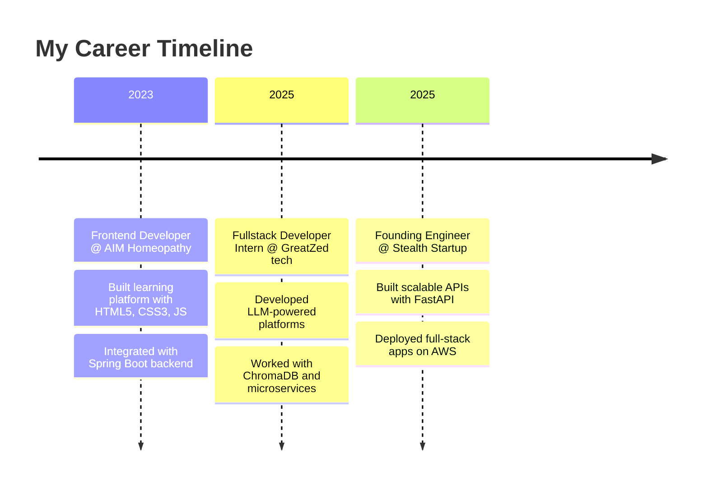

<div align="center">

# 👋 Hi there! I'm Sagar Aryaman


</div>

---

## 🚀 About Me


```javascript
const sagar = {
    pronouns: "He/Him",
    location: "India 🇮🇳",
    currentRole: "Fullstack Developer @ Jobauto.AI",
    passions: ["AI Integration", "Scalable Architecture", "Open Source"],
    currentlyLearning: ["Advanced AI/ML", "Serverless Architecture"],
    collaborateOn: ["AI Projects", "Web Applications", "Open Source"],
    askMeAbout: ["Python", "JavaScript", "FastAPI", "React", "RAG Pipelines"],
    funFact: "I debug with console.log and I'm not ashamed! 😄"
};
```

- 🔭 Currently building **AI-powered agents** and **scalable backend systems**
- 🌱 Exploring **advanced AI/ML model integration** and **serverless architectures**
- 👯 Open to collaborate on **open-source AI projects** and **innovative web apps**
- 💬 Let's talk about **Python, JavaScript, FastAPI, React, Microservices, RAG pipelines**
- 📫 Reach me at: **sagar.aryamann@gmail.com**
- 📄 Check out my [**Resume**](https://aryamann-portfolio.netlify.app/images/Sagar_Aryaman_updatedResume.pdf)

---

## 💻 Tech Arsenal

<div align="center">

### Languages & Frameworks


### Databases & Cloud


### Tools & Others


</div>

---

## 📊 GitHub Analytics

<div align="center">
  
  
</div>

<div align="center">
  
</div>

<div align="center">
  
</div>

---

## 🚀 Featured Projects

<div align="center">

<table>
<tr>
<td width="50%">
<h3 align="center">🎯 Hive Task Manager App</h3>
<div align="center">  
<a href="https://github.com/Aryaman-leo/Hive-Task-Manager-App" target="_blank">

</a>
<br><br>
<p><strong>🛠️ Built with:</strong></p>


<br><br>
<p>🔥 A sophisticated Flutter-based task management app with clean architecture, CRUD operations, and local data persistence.</p>
</div>
</td>

<td width="50%">
<h3 align="center">📈 Sensex Stock Fetcher</h3>
<div align="center">
<a href="https://github.com/Aryaman-leo/Sensex-fetcher" target="_blank">

</a>
<br><br>
<p><strong>🛠️ Built with:</strong></p>


<br><br>
<p>📊 Real-time financial dashboard displaying live stock data for all 30 Sensex companies using Yahoo Finance API.</p>
</div>
</td>
</tr>
</table>

### 🌐 AIM Homoeopathy Research Journal
<div align="center">
<a href="https://aimjhm.com/" target="_blank">

</a>
<br><br>


<br><br>
<p>🏥 Professional research journal website with responsive design for showcasing medical publications and articles.</p>
</div>

</div>

---

## 💼 Professional Journey

<div align="center">



</div>

### 🎯 Current Role - Founding Engineer @ Stealth Startup _(June 2025 – Present)_
- 🚀 Developed scalable backend APIs using **Python (FastAPI)** and **MongoDB**
- 🎨 Built responsive, dynamic UI in **React.js** with **Tailwind CSS**
- 🔐 Implemented secure **JWT authentication** and real-time chat via **WebSockets**
- ☁️ Deployed full-stack applications on **AWS** using **Docker** and **CI/CD pipelines**

### 🔬 Fullstack Developer Intern @ GreatZed tech _(April 2025 – June 2025)_
- 🤖 Developed UI for **LLM-powered platforms** integrating **React** with **Django**
- 🔍 Utilized **ChromaDB** for vector search in **microservices architecture**
- 🧠 Built **AI-driven HR tools** and recruitment platforms

### 💻 Frontend Developer @ AIM Homeopathy _(Jan 2023 – April 2025)_
- 🏫 Developed **full-featured learning and testing platform** using **HTML5, CSS3, JavaScript, Bootstrap** for seamless student experience
- ⚙️ Integrated **Spring Boot backend** and implemented version control with **Git** for collaborative development
- 📊 Utilized **PDF.js, Chart.js, Canvas.js, Bootstrap Data Tables** to enrich educational content and analytics visualizations
- 🔄 Implemented robust **API integrations** for real-time data flow and dynamic content delivery across modules
- 🔒 Conducted rigorous **performance optimization** and **security testing** for platform reliability and data protection
- 📚 Built comprehensive **research journal website** for showcasing medical publications and articles

---

## 🏆 Achievements & Certifications

<div align="center">

| 🎖️ Achievement | 🏢 Organization | 📅 Year |
|:---|:---|:---:|
| **3rd Place (AIR 3rd)** | E-Summit'23, IIT Bombay | 2023 |
| **AR/VR App Development** | IHUB Divya Sampark – IIT Roorkee | 2023 |

</div>

---

## 📈 Contribution Graph

<div align="center">

</div>

---

## 🤝 Let's Connect!

<div align="center">

[](https://linkedin.com/in/sagar-aryaman-4820811a9)
[](https://aryamann-portfolio.netlify.app/)
[](mailto:sagar.aryamann@gmail.com)

</div>

---

<div align="center">


### 💭 "Code is poetry written in logic" 


</div>
